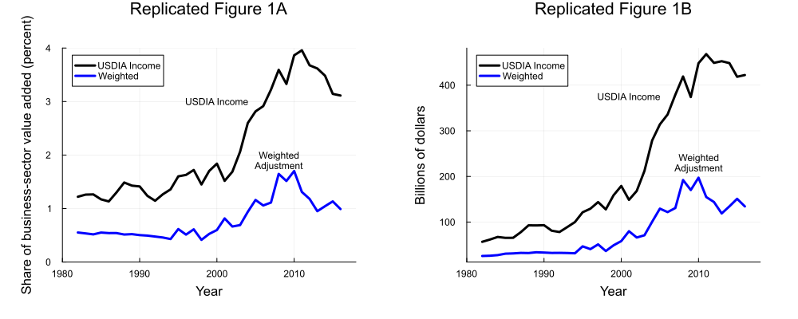
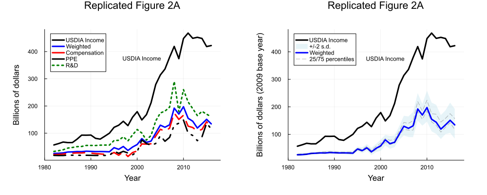
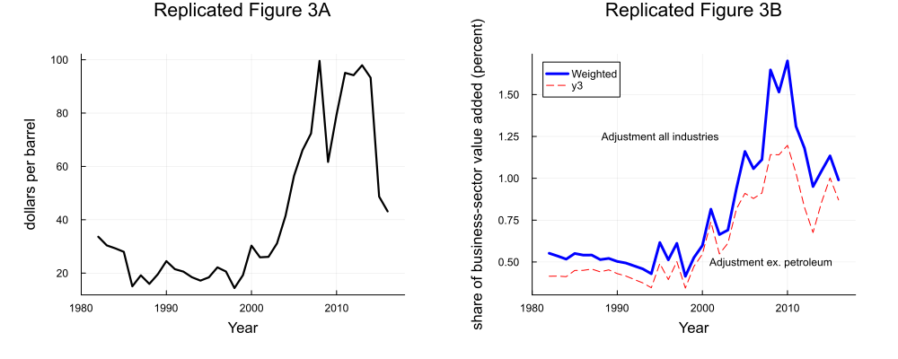
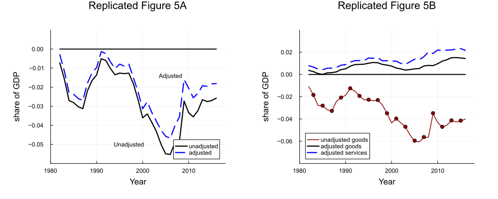
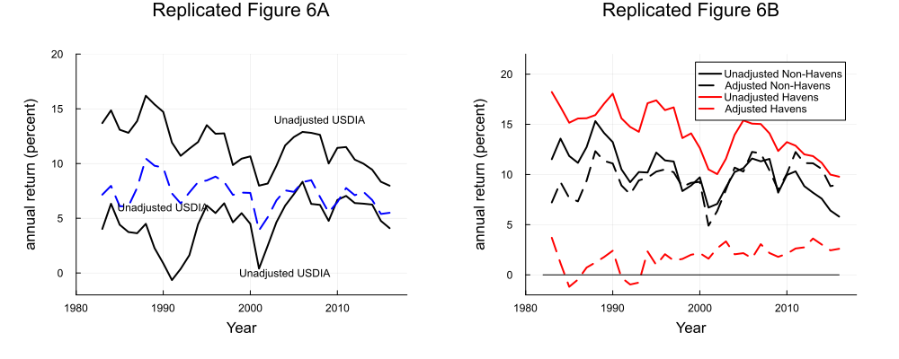
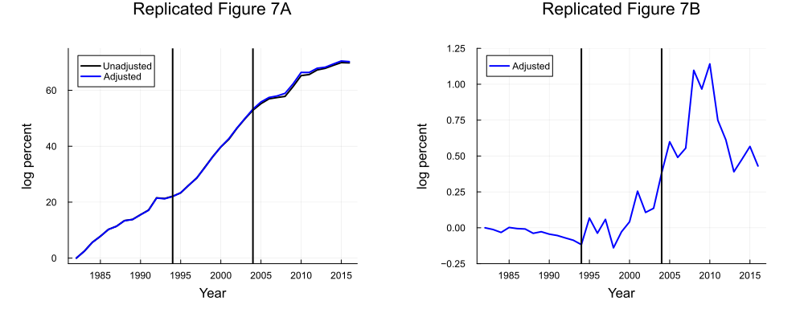
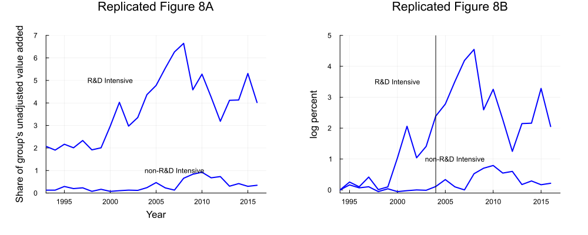
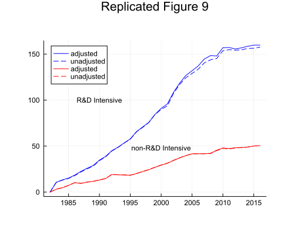
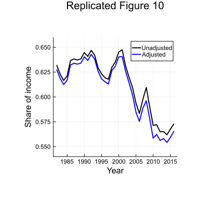
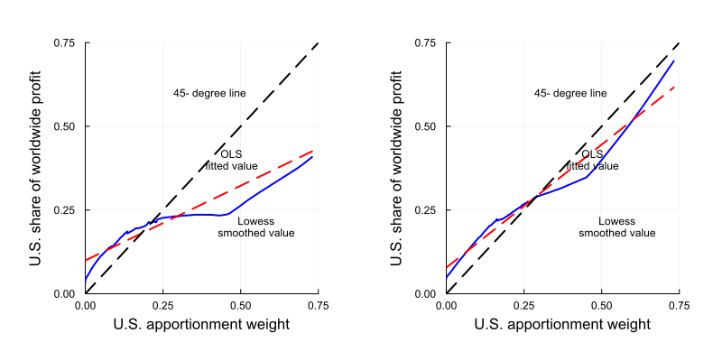

# Offshore Profit Shifting Replication

[](https://dfichmann.github.io/Offshore_Profit_Shifting_Replication.jl/dev/)
[](https://github.com/dfichmann/Offshore_Profit_Shifting_Replication.jl/actions/workflows/CI.yml?query=branch%3Amain)

This repository contains the Julia replication package for the paper:

- Guvenen, Fatih, Raymond J. Mataloni Jr., Dylan G. Rassier, and Kim J. Ruhl. 2022. **"Offshore Profit Shifting and Aggregate Measurement: Balance of Payments, Foreign Investment, Productivity, and the Labor Share."** American Economic Review, 112 (6): 1848-84. [DOI: 10.1257/aer.20190285](https://www.aeaweb.org/articles?id=10.1257/aer.20190285)

The paper shows how offshore profit shifting by US multinational enterprises affects several key measures of the US economy.

I downloaded the original python replication package from the [AER website](https://www.aeaweb.org/articles?id=10.1257/aer.20190285) and you can find the python code that I used to translate the replication into Julia here: [ReplicationFiles/Python_replicationcode.py](ReplicationFiles/Python_replicationcode.py)

## Repository Contents

- [**src**](src): Julia code for replicating the results presented in the paper.
- [**runfile.jl**](runfile.jl): Julia code that executes everything.
- [**ReplicationFiles**](ReplicationFiles): Contains python replication code, data, and my output files.
    - [**data**](ReplicationFiles): Data required for the replication.
    - [**figures**](ReplicationFiles/figures): Generated figures in PDF format.
    - [**tables**](ReplicationFiles/tables): Generated tables in Markdown format.

## Requirements

- Written in Julia 1.8.5 and tested on Julia 1.9
- Required Julia packages: DataFrames, Plots, Statistics, CSV, XLSX, Missings, Interpolations, Impute, DataFramesMeta

## How to Run

1. Clone this repository to your local machine.

    ``` shell
    git clone https://github.com/dfichmann/Offshore_Profit_Shifting_Replication.jl.git
    ```

2. Open Julia and navigate to the repository's directory.

    ``` julia
    julia            
    cd("/path/to/Offshore_Profit_Shifting_Replication") #replace with your path
    ```

3. Activate the package

    ``` julia            
    using Pkg           
    Pkg.activate(".")
    ```

4. Install all recorded dependencies

    ``` julia
    Pkg.instantiate()
    ```

5. Run the *runfile.jl* that executes all the necessary functions to produce the paper's key figures and tables. 

    ```julia 
    include("runfile.jl")
    ```
    
6. The output will then be saved in the [*figures*](ReplicationFiles/figures) and [*tables*](ReplicationFiles/tables) folders, within the ReplicationFiles folder.

## Replicated Figures and Tables
The runfile.jl does the following:
```julia
using Offshore_Profit_Shifting_Replication
```
### **Figure 1**
```julia
Offshore_Profit_Shifting_Replication.plots1()
```

- [Link to file](ReplicationFiles/figures/Figure1.png)

### **Figure 2**
```
Offshore_Profit_Shifting_Replication.plots2()
```

- [Link to file](ReplicationFiles/figures/Figure2.png)
### **Figure 3**
```
Offshore_Profit_Shifting_Replication.plots3()
```

- [Link to file](ReplicationFiles/figures/Figure3.png)

### **Figure 4**
```
Offshore_Profit_Shifting_Replication.plots4()
```

- [Link to file](ReplicationFiles/figures/Figure4.png)

### **Figure 6**
```
Offshore_Profit_Shifting_Replication.plots6()
```

- [Link to file](ReplicationFiles/figures/Figure6.png)

### **Figure 7**
``` 
Offshore_Profit_Shifting_Replication.plots7()
```

- [Link to file](ReplicationFiles/figures/Figure7.png)

### **Figure 8**
```
Offshore_Profit_Shifting_Replication.plots8()
```

- [Link to file](ReplicationFiles/figures/Figure8.png)

### **Figure 9**
```
Offshore_Profit_Shifting_Replication.plots9()
```

- [Link to file](ReplicationFiles/figures/Figure9.png)

### **Figure 10**
```
Offshore_Profit_Shifting_Replication.plots10()
```

- [Link to file](ReplicationFiles/figures/Figure10.png)

### **Figure 11**
```
Offshore_Profit_Shifting_Replication.plots11()
```

- [Link to file](ReplicationFiles/figures/Figure11.png)

### **Table 1**
```
Offshore_Profit_Shifting_Replication.table1()
```
| Country | PPE | Compensation | Employment (mil. USD) |
| --- | --- | --- | --- |
| World | 16.8 | 39.0 | 1.8 |
| Canada | 6.4 | 21.2 | 1.2 |
| Ireland | 20.0 | 142.7 | 10.9 |
| Luxembourg | 1019.6 | 1380.0 | 121.6 |
| Netherlands | 97.7 | 115.3 | 8.7 |
| Switzerland | 59.9 | 60.0 | 7.7 |
| Barbados | 41.8 | 1444.7 | 43.3 |
| Bermuda | 130.8 | 1475.5 | 155.8 |
| U.K.I., Caribbean | 101.2 | 3330.2 | 199.8 |
| Hong Kong | 40.3 | 39.3 | 2.7 |
| Singapore | 18.6 | 50.3 | 3.1 |

[Link to file](ReplicationFiles/tables/Table1.md)

### **Table 2**
```
Offshore_Profit_Shifting_Replication.table2()
```
| CountryName | share adj earn | share income |
| --- | --- | --- |
| Bermuda | 30.036 | -81.791 |
| Canada | -4.013 | 26.785 |
| China | -3.08 | 34.59 |
| France | -5.37 | 242.52 |
| Germany | -7.961 | 211.725 |
| Ireland | 23.138 | -54.263 |
| Italy | -3.68 | 296.322 |
| Japan | -2.127 | 87.965 |
| Luxembourg | 17.788 | -65.217 |
| Netherlands | 42.142 | -64.52 |
| Singapore | 10.619 | -52.508 |
| Switzerland | 12.144 | -46.93 |
| United Kingdom | -4.575 | 26.804 |
| United Kingdom Islands, Caribbean| 21.044 | -84.222 |

[Link to file](ReplicationFiles/tables/Table2.md)

### **Table 5**
```
Offshore_Profit_Shifting_Replication.table5()
```
| Intervals | Cumulative Growth Rate (Unadjusted) | Cumulative Growth Rate (Adjusted) | Average Annual Growth Rate (Unadjusted) | Average Annual Growth Rate (Adjusted) |
| --- | --- | --- | --- | --- |
| 1982--2016 | -69.8 | -70.2 | 2.1 | 2.1 |
| 1982--1994 | -22.1 | -22.0 | 1.8 | 1.8 |
| 1994--2004 | -30.8 | -31.3 | 3.1 | 3.1 |
| 2004--2016 | -16.9 | -17.0 | 1.4 | 1.4 |
| 2004--2010 | -12.4 | -13.1 | 2.1 | 2.2 |
| 2010--2016 | -4.6 | -3.9 | 0.8 | 0.6 |

[Link to file](ReplicationFiles/tables/Table5.md)

### **Table 6**
```
Offshore_Profit_Shifting_Replication.table6()
```
| RowNames | 82-94 | 94-16 | 94-04 | 04-16 | 04-08 | 08-16 |
| --- | --- | --- | --- | --- | --- | --- |
| R&D intensive adjusted | 53.4 | 106.4 | 73.5 | 32.9 | 21.6 | 11.3 |
| R&D intensive unadjusted | 53.3 | 104.3 | 71.1 | 33.3 | 19.4 | 13.8 |
| non-R&D intensive adjusted | 18.6 | 32.0 | 21.1 | 10.8 | 2.5 | 8.3 |
| non-R&D intensive unadjusted | 18.7 | 31.8 | 21.0 | 10.7 | 2.1 | 8.6 |

[Link to file](ReplicationFiles/tables/Table6.md)

 ### Missing Tables

You may notice that there are 2 missing tables in the project. I replicated all the graphs and the important tables and this is as far as I got. I'm not sure why those last two weren't working - it may be because of an issue with the confidential data. Alas, given that there were so many figures and tables to reproduce, I eventually decided to prioritize understanding github actions, docstrings, and other cool aspects of this replication. I'll keep trying though. 

## Documentation and Tests

You can find the documentation explaining my functions and arguments here: [documentation link](https://dfichmann.github.io/Offshore_Profit_Shifting_Replication.jl/dev/). 

Here you can check out how the dataframes are created in julia by looking at, for example, the documentation for the [makeplotdata()](https://dfichmann.github.io/Offshore_Profit_Shifting_Replication.jl/dev/#Offshore_Profit_Shifting_Replication.makeplotdata-NTuple{4,%20Any}) function. 

Github Actions runs the tests and is green when they pass. To run them yourself. To verify this you can delete all the figures inside their respective folders and then run <span style="color:green">**julia>**</span>
 include(`"test/runtests.jl"`). This runs 4 tests that should all pass :white_check_mark:
